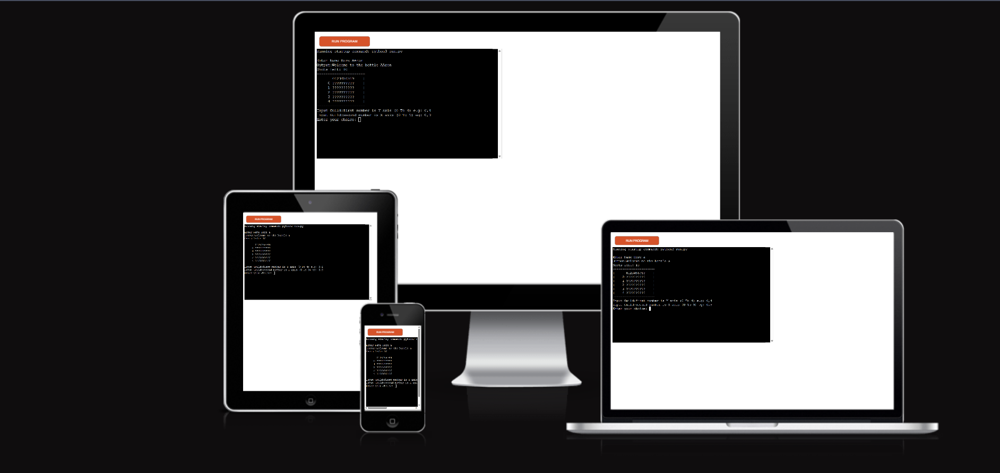

# The Quiz Game

The Battle Ships is a Python terminal game, which runs in a mock terminal on Heroku.

Users can play the game and see if you can win in 10 shots

[Play the live version of the project on Heroku](https://battle-ships-single-e8c9730c38b1.herokuapp.com/)

## How to play
This game is a very simple game all the player has to do is write in the coordinates in a format of 0,0, only two numbers with a comma inbetween with no spaces. 
## Features
- The game has a player input that chooses there position they wish ti hit on the grid
- Inputs are all checked and will give an example of what to put
- The game has a shot count down
- there is a message at the end if you win or lose  
### Game Workflow

 flow of the game:
1. first thing you have to do is enter your name 
[First sight](docs/image/first_play.png)
2. the next part prints out your name and then the game begins 
[Second part](docs/image/second_stage.png)
3. choose your coordinates and press enter
[Third part](docs/image/third_stage.png)
4. if you write in the wrong input you get this:
[wrong input](docs/image/wrong_inpute_message.png)

### Existing Features

- input configuration
    - :
        - 

        

        -

        

        - 

        

        - 

        
        
    - 
        
        -  
        
        
        
        - 
        
        
    
    - 
    
    - 
    
    
    
    - 
    
### Future Features
    - two player mode
    - npc board 
    - more ships and ally ships too
    - "bigger badder mode" so bigger grid bigger ships and more twists

## Data Model

I used a series of classes, each class is used for a different parts of the game.
The following classes are the classes that are implemented which are listed below:
- Player_Input
- Battleship
- Grid_Drawing
- Player_Input_checks
- Game

### Player_Input Class
This creates the input that the player uses and also checks all the outcomes in case the player has entered the wrong input.

### Battleship Class
This class creates a ship object with a given position on the grid. It also keeps track of the ship's status, whether it is alive or not, using a boolean attribute. When the ship is hit by the player's input, it changes its symbol from 'S' to 'H' on the grid, and updates its status accordingly.

### Grid Drawing Class
The Grid class is responsible for creating and displaying the grid on the console. It also keeps track of the missed shots. It has also make the grid boarder too.

### Player Input Checker Class
This class is similar to the PlayerInput class, but it mainly handles the input of letters and numbers. It ensures that the name and the number inputs are valid and have the correct length.

### Game Class
The Game class is the core of the game logic and functionality. It has methods that handle the round countdown, the grid update, the end game message, and the display of misses and score.

## Technology Used

### Languages
The language used to create this project:
- Python

### Dependencies
The project requires the following dependencies is order to run successfully:
- Python3

The following libraries are also required to run this project:
- from random import randint
- import time
- import random

## Testing

### Bugs

#### Solved Bugs
- when you would hit on ship i hit them all. solution: I had used the same variable name so change them to septate ones.
- the input would accept anything. Solution: to fix this I made rules for the input and kept checking.
- printing out the grid. Solution: to fix this I had to do some research and found out it was my syntax and I had mixed up values

#### Remaining Bugs
- the only thing i couldn't get working is to stop the player from hitting the same grid numbers twice.
- misses always skips the first one.

### Validator Testing

All code has been validated using the [Code Institute PEP8 validator](https://pep8ci.herokuapp.com/#)

- run.py validation

## Deployment & Local Development

### Local Development
#### How to clone the repository
To Clone the Quiz Game repository:

1. Log in to Github
2. Got to the repository for this application
3. Click on the Code button at the top right of the screen and select HTTPS, SSH, or GitHub CLI
4. Copy the link
5. Open the terminal on your code editor in the directory where the project needs to be cloned
6. Enter `git clone` into the terminal and paste the Github link
7. Press enter to clone the repository

#### How to fork the repository
To fork the Game Repository:

1. Log in to Github
2. Go to the repository for this project
3. Select Fork at the top of the screen

### How to deploy the game

1. step one use this link to get to Heroku website [link](https://dashboard.heroku.com/apps/battle-ships-single/metrics)
[image of home page](docs/image/heroku_home_page.png)
2. click on the new button top right of the screen 
[New Button](docs/image/new_button.png)
3. Next go to the settings tab always do the setting first fill in the name 
[settings page](docs/image/Name_stage_deplyment.png)
4. The next stage is picking the build packs all you need for this game is python and jsnode. make sure python is the top one on the load order
[Build Packs](docs/image/build_pack_mini_window.png)
5. Now you can start the deployment first you need to link it too your github
[Deployment stage](docs/image/connecting_to_github.png)
6. when thats all connected press deploy
[deployment execute](docs/image/deployment_page.png)
[Deployment mini window](docs/image/manual_deployment.png)

#### Reminders

- Do not edit any of the other files or your code may not deploy properly

#### Creating the Heroku app

When you create the app, you will need to add two buildpacks from the _Settings_ tab. The ordering is as follows:

1. `heroku/python`
2. `heroku/nodejs`

You must then create a _Config Var_ called `PORT`. Set this to `8000`

Connect your GitHub repository and deploy as normal.

#### Constraints

### Code Credits
these are the websites I used to help me beat some of the bugs I encountered.
[flex box froggy](https://flexboxfroggy.com/)
I used this to help understand how the flexbox works.
[W3 learing](https://www.w3schools.com/css/css_positioning.asp)
this was the main one for any issues and to remind me of the syntax.
[code instituet](https://learn.codeinstitute.net/ci_program/diplomainfullstacksoftwarecommoncurriculum)
this was also the big one that helped me used bits from the Love Running project to help me understand
my form and all the socials were the big ones.
[Python Validator](https://pep8ci.herokuapp.com/#)
 for checking my work.
 
 [Am I Responsive](https://ui.dev/amiresponsive?url=https://doublearon96.github.io/Samcohoses/index.html)

 [Jay leighton](https://github.com/jayleighton/quiz-game/blob/main/README.md)
 I used Jay's Read me to help make my own one.
#### Direct people

Ciaran merritt my friend from school,
Harry Dhillon my tutour support

